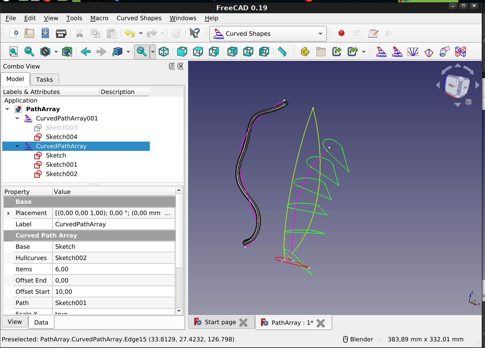
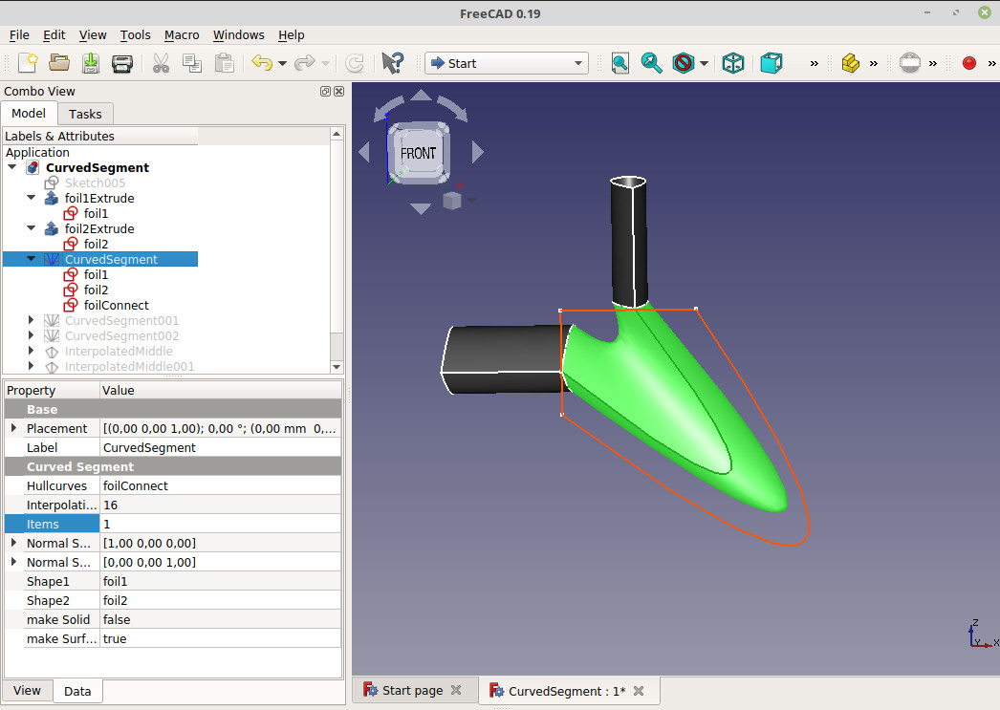
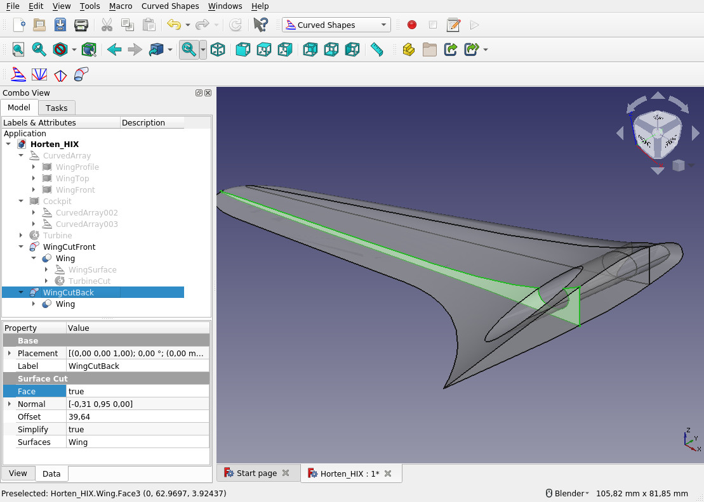
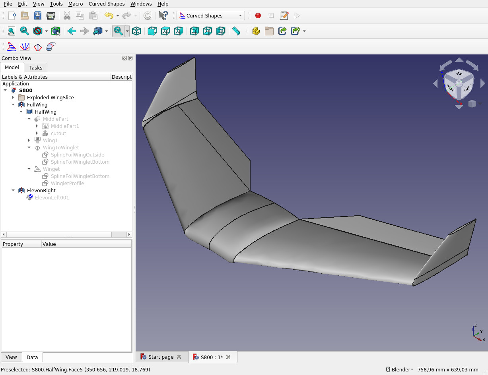

# Curved Shapes
[> english <](https://github.com/chbergmann/CurvedShapesWorkbench/blob/master/README.md)  
  
FreeCAD Arbeitsbereich zum Erstellen von 3D Körpern aus 2D Kurven
  
## Installation

Dieser Arbeitsbereich kann über den Addon manager in FreeCAD installiert werden.

**Manuelle Installation**
- `cd` in deinen FreeCAD Ordner (normalerweise `~/.FreeCAD` on Linux)
- `cd Mod/` (Ordner Mod anlegen, falls er nicht existiert)
- `git clone https://github.com/chbergmann/CurvedShapesWorkbench.git`
- Starte FreeCAD

"Curved Shapes" sollte nun in der Liste der Arbeitsbereiche auswählbar sein.
  
## Video Tutorial
Hier ein großartiges Tutorial von JOKO engineering (in englisch)

  
  
## Werkzeuge
###  Curved Array
Erstellt mehrere Kopien von einem Basisobject (Base) und verschiebt diese und passt die Größe an innerhalb von einer oder mehreren Hüllkurven (Hullcurves)  
In dem Beispiel unten wird das rote Flügelprofil innerhalb der orangenen Hüllkurven vervielfacht.  
Base und Hullcurves brauchen nicht miteinanden verbunden sein und sollten in einer der Raumebenen XY, XZ, oder YZ liegen. 

  
Zuerst das Basisobjekt auswählen, danach die Hüllkurven. Dann ein Curved Array objekt erstellen.

#### Parameters
- Base: Das Basisobjekt
- Hullcurves: Eine oder mehrere Hüllkurven        
- Axis: Richtung, in der die Array Elemente aufgebaut werden (wird automatisch berechnet)
- Items: Anzahl der Array Elemente
- OffsetStart: Abstand des ersten Array Elements vom Anfang der Hüllkurven
- OffsetEnd: Abstand des letzten Array Elements vom Ende der Hüllkurven
- Twist: (Winkel in Grad) Lässt die Array Elemente rotieren
- Surface: Eine Oberfläche erstellen
- Solid: Einen Festkörper erstellen (funktioniert nur, wenn Base eine geschlossene Form ist)
- Distribution: Algorithmus zur Berechnung der Distanz zwischen den Elementen. Default ist 'linear'. Weitere Möglichkeiten: parabolic (x²), x³, sinusoidal, elliptic
- DistributionReverse: Kehrt die Richtung des Distrubution Algorithmus um

Distribution Linear  
  
  
Distribution parabolic  
  
  
Distribution x³  
  
  
Distribution sinusoidal  
 
   
Distribution elliptic  
  

Wenn man eine Oberfläche erstellt (Surface = True), können mit Distribution evtl. bessere Ergebnisse erzielt werden.
Für elliptische Flügel kann elliptic die beste Lösung sein.
Bei einem CurvedArray in einem Halbkreis ist sinusoidal am Besten.
Parabolic oder x³ sind evtl. bei spline curves die beste Wahl.
Im Zweifelsfall linear wählen.

Möglichkeiten zur Verbesserung der generierten Form:  
Die erste Möglichkeit das Ergebnis zu verbessern ist den Parameter Items zu erhöhen auf z.B. 100. Das erhöht die Auflösung und macht die Rundungen runder, dauert aber länger bis es fertig berechnet ist.
Zwite Möglichkeit: Für Offset Start und/oder Offset End größere Werte eingeben, z.B. 0,1. Damit wird die erste bzw. die letzte Scheibe nicht am äußersten Punkt der Hüllkurven generiert, sondern 0,1mm davon entfernt.

Array Elemente aus Curved Array extrahieren (funktioniert nur, wenn Surface und Solid false sind): In der Part workbench, Menü Formteil -> Flächenverbund -> Verbundteile extrahieren 
  
###  Curved Path Array
Erstellt mehrere Kopien von einem Basisobject (Base) und ordnet diese rechwinklig zu einer Kurve (Path) an. Optional können Größe und Position innerhalb von einer oder mehreren Hüllkurven (Hullcurves) ausgerichtet werden.  
Ein Twist Parameter lässt die Elemente um die Path Kurve rotieren.  
Ohne Hullcurves und Twist ist dieses Tool ähnlich dem Sweep Path Tool aus der Draft workbench.

  

#### Parameters
- Base: Das Basisobjekt
- Path: Basisobjekte werden an dieser Kurve ausgerichtet
- Hullcurves: (optional) Eine oder mehrere Hüllkurven    
- Items: Anzahl der Array Elemente
- OffsetStart: Abstand des ersten Array Elements vom Anfang von Path
- OffsetEnd: Abstand des letzten Array Elements vom Ende von Path
- Twist: (Winkel in Grad) Lässt die Array Elemente um Path rotieren
- Surface: Eine Oberfläche erstellen
- Solid: Einen Festkörper erstellen (funktioniert nur, wenn Base eine geschlossene Form ist)
- ScaleX: Hullcurves können in X Richtung skalieren
- ScaleY: Hullcurves können in Y Richtung skalieren
- ScaleZ: Hullcurves können in Z Richtung skalieren

Wenn Hullcurves verwendet werden und die Objekte nicht rechtwinklig zum Path angeordnet sind, muss evtl. die Skaliereng in eine Raumrichtung ausgeschaltet werden, in dem ScaleX, ScaleY oder ScaleZ auf false gesetzt wird.

  
###  Curved Segment
Interpoliert zwischen zwei 2D Kurven. Die interpolieren Kurven können innerhalb von Hüllkurven angeordnet werden.  
 

Zuerst zwei 2D Kurven auswählen, dann optional noch eine oder mehrere Hüllkurven. Danach das Curved Segment Werkzeug verwenden. 

#### Parameters
- Shape1: Das erste Object des Segments
- Shape2: Das letzte Object des Segments
- Hullcurves: Keine, eine oder mehrere Hüllkurven. Alle Hüllkurven sollten in der XY, XZ oder YZ Raumebene liegen.   
- NormalShape1: Richtung, in der die Array Elemente von Shape1 aus aufgebaut werden (wird automatisch berechnet)
- NormalShape2: Richtung, in der die Array Elemente von Shape2 aus aufgebaut werden (wird automatisch berechnet)
- Items: Anzahl der Array Elemente
- makeSurface: Eine Oberfläche erstellen
- makeSolid: Einen Festkörper erstellen (funktioniert nur, wenn Base eine geschlossene Form ist)
- InterpolationPoints: Wenn Shape1 und Shape2 verschiedenartige Objekte sind, werden die Kurven in diese Anzahl von Einzelpunkten zerlegt  
- Twist: (Winkel in Grad) kann eine Rotation zwischen Shape1 unf Shape2 kompensieren
- TwistReverse: wenn True, wird die Drehrichtung geändert
- Distribution: Algorithmus zur Berechnung der Distanz zwischen den Elementen. Default ist 'linear'. Weitere Möglichkeiten: parabolic (x²), x³, sinusoidal, elliptic
- DistributionReverse: Kehrt die Richtung des Distrubution Algorithmus um

###  Interpolated Middle
Interpoliert eine 2D Kurve in der Mitte zwischen zwei 2D Kurven. Es kann ein Verbinder mit einem Knick zwischen den den Kurven generiert werden.

 
#### Parameters
- Shape1: Die erste 2D Kurve
- Shape2: Die zweite 2D Kurve     
- NormalShape1: Richtung, in der das Mittel Element von Shape1 aus aufgebaut wird (wird automatisch berechnet)
- NormalShape2: Richtung, in der das Mittel Element von Shape2 aus aufgebaut wird (wird automatisch berechnet)
- makeSurface: Eine Oberfläche erstellen
- makeSolid: Einen Festkörper erstellen (funktioniert nur, wenn Base eine geschlossene Form ist)
- InterpolationPoints: Wenn Shape1 und Shape2 verschiedenartige Objekte sind, werden die Kurven in diese Anzahl von Einzelpunkten zerlegt  
- Twist: (Winkel in Grad) kann eine Rotation zwischen Shape1 unf Shape2 kompensieren
- TwistReverse: wenn True, wird die Drehrichtung geändert
- Distribution: Algorithmus zur Berechnung der Distanz zwischen den Elementen. Default ist 'linear'. Weitere Möglichkeiten: parabolic (x²), x³, sinusoidal, elliptic
- DistributionReverse: Kehrt die Richtung des Distrubution Algorithmus um
  
  
###  Surface Cut
Generiert einen Schnitt durch eine oder mehrere Oberflächen. Das Tool versucht, sich überlappende Kanten zu entfernen.

#### Parameters
- Surfaces: Ein oder mehrere Oberflächenobjekte
- Normal:   Vector, der senkrecht auf der Schneidefläche steht
- Position: Position der Schneidefläche
- Face:     Den Oberflächenschnitt ausfüllen
- Simplify: Wenn > 0, wird eine Näherungskurve über die Oberfläche geleg. Dieser Wert bestimmt die Anzahl der Polstellen. Bei komplexen Oberflächen kann das die resultierende Schnittkurve drastisch vereinfachen und Rechenzeit reduzieren. In machen Fällen entsteht aber Murks.
  
  
###  Notch Connector
Schneidet Kerben in zwei sich überlagende Objekte, so dass diese zusammengesteckt werden können.
  
  
  
Zuerst zwei sich überlagende Objekte in FreeCAD auswählen, dann Notch Connector auswählen. Es werden zwei NotchConnector Objekte erstellt.

#### Parameters
- Base:  		Erstes Objekt
- Tools: 		Zweites und optional noch mehrere Objekte 
- CutDirection: Schnittrichtung (wird automatisch berechnet). Bitte ändern, wenn der Schnitt in die falsche Richtung gemacht wird.
- CutDepth: 	Tiefe des Schnitts in Prozent

## Beispiele
Beispiele zum Testen und zur Demonstration dieses Arbeitsbereichs. 

###  Horten H IX
Ein Python Skript zum Generieren einer [Horten H IX (auch Horten Ho 229 genannt)](https://de.wikipedia.org/wiki/Horten_H_IX), ein Stealth Fighter aus dem 2. Weltkrieg, der seiner Zeit um Jahrzehnte voraus war.

###  Flying Wing S800 
Ein Python Skript, dass einen Nurflügler generiert. 
  

### Faster Better Corsair |JOKO ENGINEERING|
 

## Diskussion
[offizeller Thread im FreeCAD Forum (englisch)](https://forum.freecadweb.org/viewtopic.php?f=8&t=36989)  
[Beitrag im FreeCAD Forum in Deutsch](https://forum.freecadweb.org/viewtopic.php?f=13&t=42684).

## Lizenz
GNU Lesser General Public License v3.0
