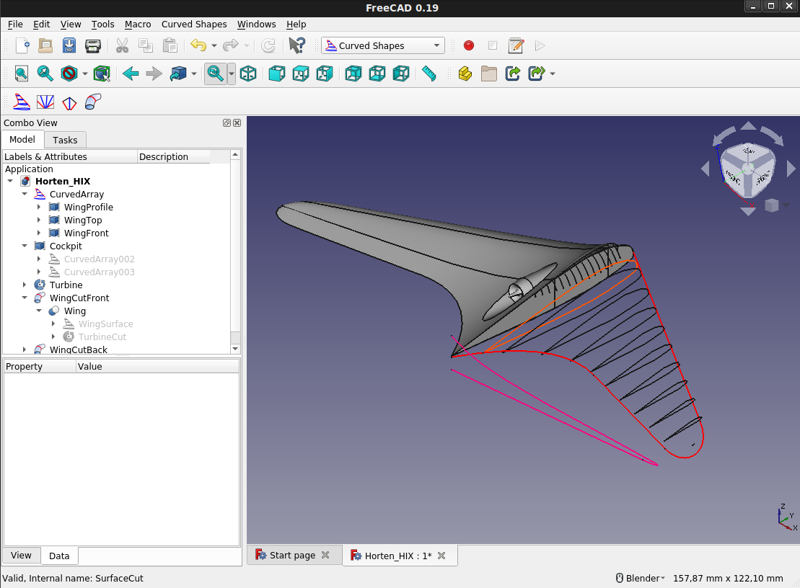
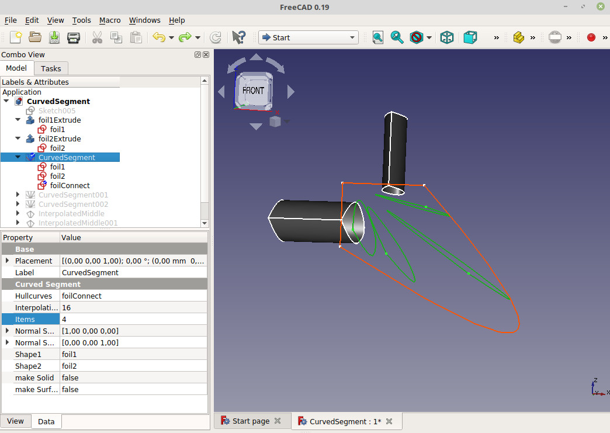

# Curved Shapes
[> deutsch <](LIESMICH.md) 
   
FreeCAD Workbench for creating 3D shapes from 2D curves
  
## Installation

You can install this workbench from the Addon manager in FreeCAD.

**Manual installation**
- `cd` in to your your personal FreeCAD folder (usually `~/.FreeCAD` on Linux)
- `cd Mod/` (or create this folder if it doesn't exist)
- `git clone https://github.com/chbergmann/CurvedShapesWorkbench.git`
- Start FreeCAD

**Result**: "Curved Shapes" workbench should now show up in the workbench dropdown list.
  
## Tools
###  Curved Array
Creates an array and resizes the items in the bounds of one or more hull curves.
In this example, the orange base shape is rescaled in the bounds of the red and violet hullcurves. The curves do not have to be connected.  
The hullcurves should lie on or parallel to the XY- XZ- or YZ- plane.  

  
The first curve that you select for CurvedArray creation will be the item that is swept and resized in the bounds of the other selected curves.

#### Parameters
- Base: The object to make an array from
- Hullcurves: List of one or more bounding curves        
- Axis: Direction axis of the Base shape
- Items: Nr. of array items
- OffsetStart: Offset of the first part in Axis direction
- OffsetEnd: Offset of the last part from the end in opposite Axis direction
- Twist: Applies a rotation around Axis to the array items. 
- Surface: make a surface over the array items
- Solid: make a solid if Base is a closed shape

If you create a surface or solid and it looks weird, this may be caused by very small items at the start and end of the CurvedArray. In this case, enter values bigger than 0 for Start Offset and End Offset. This will create bigger start and end items located not at the very end.

To resolve a CurvedArray item to a compound of single objects, go to the Part workbench. In the Part menu, select Compound -> Explode compound  
  
###  Curved Segment
Interpolates between two 2D curves. The interpolated curves can be resized in the bounds of some hullcurves.  
 

Select two 2D shapes first. The curved segment will be created between them. If you want to use hullcurves, select them also. Then create the Curved Segment.

#### Parameters
- Shape1: The first object of the segment
- Shape2: The last object of the segment
- Hullcurves: List of one or more bounding curves in XY, XZ or YZ plane (optional)       
- NormalShape1: Direction axis of Shape1 (auto computed)
- NormalShape2: Direction axis of Shape2 (auto computed)
- Items: Nr. of items between the segments
- makeSurface: make a surface over the array items
- makeSolid: make a solid if Base is a closed shape
- InterpolationPoints: ignored if Shape1 and Shape2 have the same number of edges and poles. Otherwise all edges will be splitted (discretized) into this number of points  
- Twist: Compensates a rotation between Shape1 and Shape2
- Reverse: Reverses the rotation of one Shape

###  Interpolated Middle
Interpolates a 2D shape into the middle between two 2D curves. The base shapes can be connected to a shape with a sharp corner.

 
#### Parameters
- Shape1: The first object of the segment
- Shape2: The last object of the segment     
- NormalShape1: Direction axis of Shape1 (auto computed)
- NormalShape2: Direction axis of Shape2 (auto computed)
- makeSurface: connect Shape1 and Shape2 with a surface over the interpolated middle
- makeSolid: make a solid if Shape1 and Shape2 are closed shapes
- InterpolationPoints: ignored if Shape1 and Shape2 have the same number of edges and poles. Otherwise all edges will be splitted (discretized) into this number of points  
- Twist: Compensates a rotation between Shape1 and Shape2
- Reverse: Reverses the rotation of one Shape
  
  
###  Surface Cut
Cuts a surface to get the outline curve or a face.  
This tool is similar to Cross-Sections in the Part workbench, but it is fully parametric and has an option to reduce the complexity of the output curve.
It tries to remove overlapping edges.

#### Parameters
- Surfaces: List of objects with a surface
- Normal:   Normal vector of the cut plane
- Position: Position of the cut plane relative to Surfaces
- Face:     create a face
- Simplify: reduce the number of poles in complex curves. If true, an approximation curve is calculated. This may drastically reduce the number of points in some curves. This speeds up the usage of the result curve. In special cases this may not work as expected.  
  
  
###  Notch Connector
Cuts notches into overlapping objects to make it connectable to each other.  
  
  
  
Select two objects, then select Notch Connector. Two NotchConnector objects will be created.

#### Parameters
- Base:  		Object to cut
- Tools: 		The object that cuts Base   
- CutDirection: The direction of the cut (autocomputed)    
- CutDepth: 	The depth of the cut in percent

## Example Scripts
Example designs for testing and presentation of this workbench.  

###  Horten H IX
It is a python script that creates the shape of the [Horten Ho 229 (also called Horten H IX)](https://en.wikipedia.org/wiki/Horten_Ho_229), a stealth fighter that has been build in Germany in 1944.

###  Flying Wing S800 
It is a python script that creates the shape of a flying wing RC model.  
  

## Discussion
Please offer feedback or connect with the developer in the [dedicated FreeCAD forum thread](https://forum.freecadweb.org/viewtopic.php?f=8&t=36989).

## License
GNU Lesser General Public License v3.0
