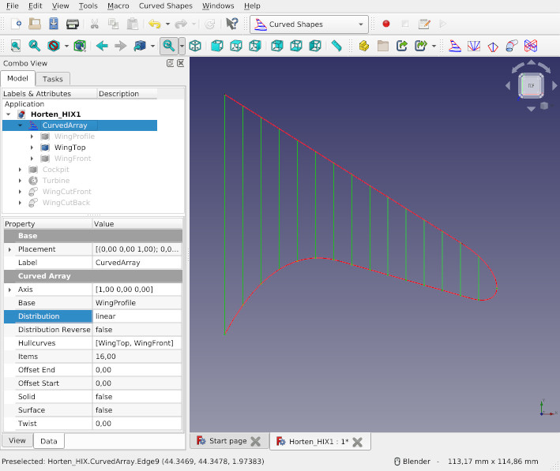
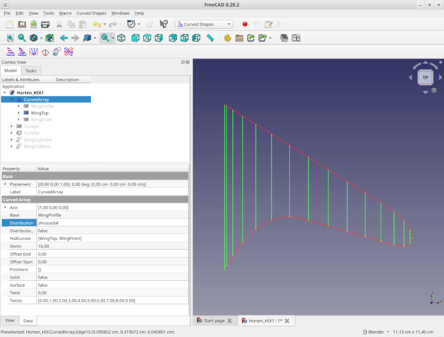
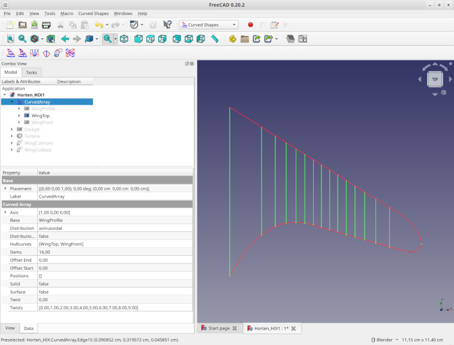
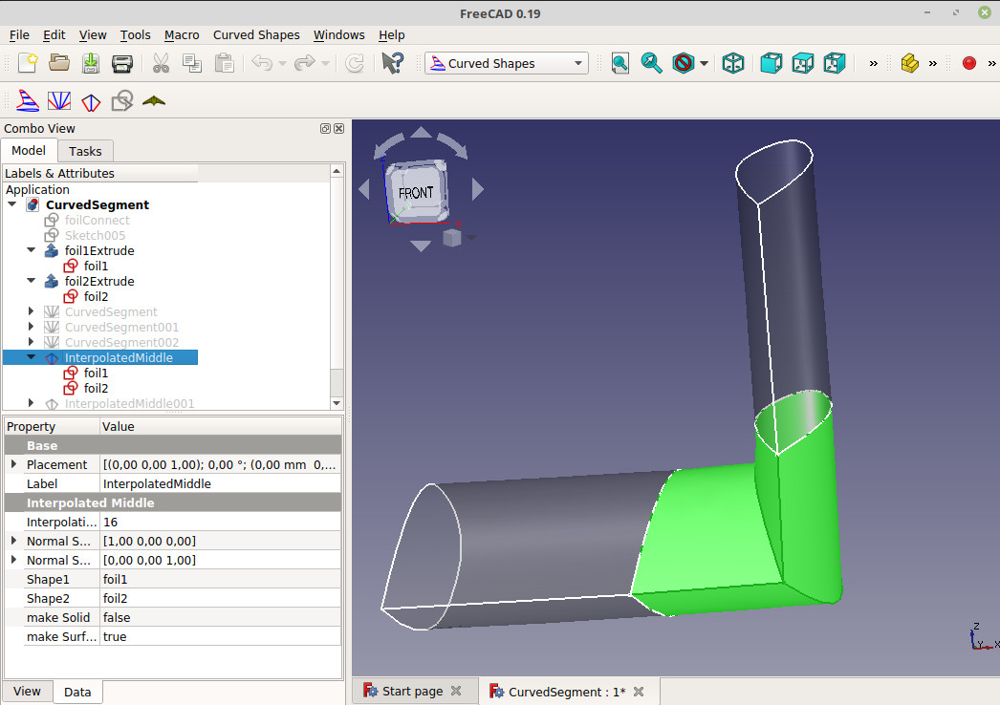
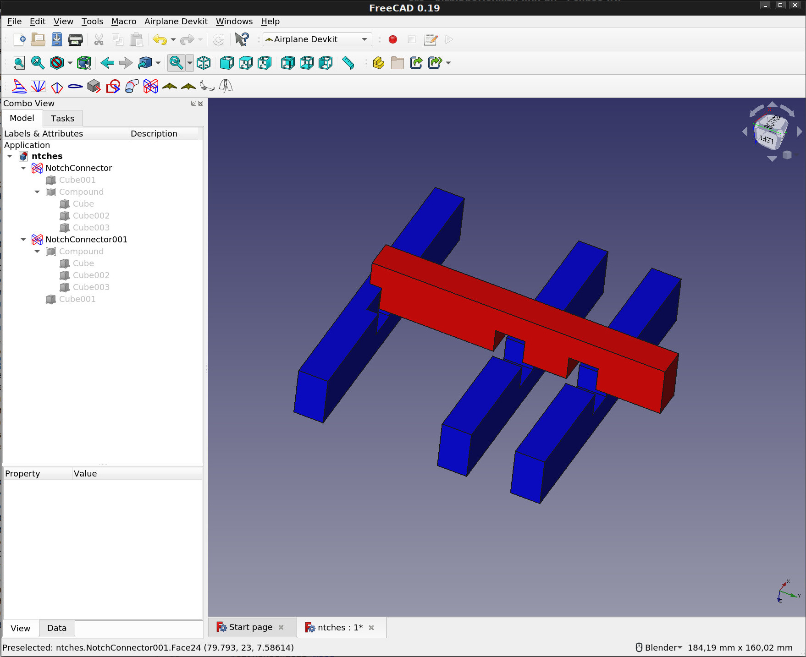

# Curved Shapes Workbench
[](https://lgtm.com/projects/g/chbergmann/CurvedShapesWorkbench/alerts/) [](https://lgtm.com/projects/g/chbergmann/CurvedShapesWorkbench/context:python)  
[> deutsch <](https://github.com/chbergmann/CurvedShapesWorkbench/blob/master/LIESMICH.md)  

A FreeCAD External Workbench for creating 3D shapes from 2D curves

## Installation

### Automatic Installation
[](https://github.com/FreeCAD/FreeCAD-addons)  
**Note: This is the recommended way to install this workbench.**  
The Curved Shapes workbench is available through the builtin FreeCAD [Addon Manager](https://github.com/FreeCAD/FreeCAD-addons#1-builtin-addon-manager).
Once installed all that is needed is to restart FreeCAD and the workbench will be available in the [workbench dropdown list](https://freecadweb.org/wiki/Std_Workbench) menu.

### Manual Installation

```bash
cd ~/FreeCAD/Mod/ 
git clone https://github.com/chbergmann/CurvedShapesWorkbench.git
```
When you restart FreeCAD, "Curved Shapes" workbench should now show up in the [workbench dropdown list](https://freecadweb.org/wiki/Std_Workbench).
  
## Video Tutorial
JOKO engineering made a great tutorial

[](http://www.youtube.com/watch?v=Wls0cqhVCc4 "FreeCAD Curved Shapes WB: Make Insane and Exact Surfaces Quick! |JOKO ENGINEERING|")  
  
## Tools
###  Curved Array
Creates an array and resizes the items in the bounds of one or more hull curves.
In this example, the orange base shape is rescaled in the bounds of the red and violet hullcurves. The curves do not have to be connected.  
The hullcurves should lie on or parallel to the XY- XZ- or YZ- plane.  


  
The first curve that you select for CurvedArray creation will be the item that is swept and resized in the bounds of the other selected curves.

#### Parameters
- Base: The object to make an array from
- Hullcurves: List of one or more bounding curves        
- Axis: Direction axis of the Base shape
- Items: Nr. of array items
- Positions: Array of position for each rib (as floats from 0.0 to 1.0) -- overrides Items
- OffsetStart: Offset of the first part in Axis direction
- OffsetEnd: Offset of the last part from the end in opposite Axis direction
- Twist: Applies a rotation around Axis to the array items. Only used if Twists is an empty array
- Twists: Array of rotation angles for each rib. If empty, parameter Twist is used.
- Surface: make a surface over the array items
- Solid: make a solid if Base is a closed shape
- Distribution: Algorithm for distance between array elements. Default is 'linear'. Also selectable: parabolic (x²), x³, sinusoidal, asinusoidal, elliptic
- DistributionReverse: Reverses the direction of the Distribution algorithm
- LoftMaxDegree: degree for surface or solid creation. Play with this parameter if your surface or solid looks distorted

Distribution Linear  
  
  
Distribution parabolic  
  
  
Distribution x³  
  
  
Distribution sinusoidal  
 
   
Distribution asinusoidal  
 

Distribution elliptic  
  
If you create a surface with the Curved Array, a different distribution may give you better results.

If you create an elliptic wing, distribution elliptic would be the best solution.
If you create the Curved Array inside a half circle, sinusoidal is best.
If the hullcurves are created from simple spline curves, parabolic or x³ may give you the best results.
If you are unsure, choose linear.

If you create a surface or solid and it looks weird, this may be caused by very small items at the start and end of the CurvedArray. In this case, enter values bigger than 0 for Start Offset and End Offset. This will create bigger start and end items located not at the very end.

To resolve a CurvedArray item to a compound of single objects, go to the Part workbench. In the [Part workbench](https://www.freecadweb.org/wiki/Part_Workbench), select **Part → Compound → [Explode compound](https://www.freecadweb.org/wiki/Part_ExplodeCompound)**
  

###  Curved Path Array
Creates an array, sweeps the elements around a path curve, and resizes the items in the bounds of optional hullcurves.  
The items created will be perpendicular to the sweep path.  
There is a twist parameter to let the items rotate around the sweep path.
If you do not use hullcurves and twist, this tool is similar to the Path Array tool in the Draft workbench.

  

The first curve that you select for Curved Path Array creation will be the base item. The second selected curve will become the path. All curves selected after that will be the hullcurves.

#### Parameters
- Base: The object to make an array from
- Path: Sweep path
- Hullcurves: List of one or more bounding curves   
- Items: Nr. of array items
- OffsetStart: Offset of the first part from the beginning of the sweep path
- OffsetEnd: Offset of the last part from the end in opposite direction
- Twist: Rotate in degrees around the sweep path
- Surface: make a surface over the array items
- Solid: make a solid if Base is a closed shape
- ScaleX: Scale by hullcurves in X direction
- ScaleY: Scale by hullcurves in Y direction
- ScaleZ: Scale by hullcurves in Z direction
- LoftMaxDegree: degree for surface or solid creation. Play with this parameter if your surface or solid looks distorted

The parameters ScaleX, ScaleY and ScaleZ have been added because you may want to rescale the items only in one direction, but the hullcurves normally cover 2 or three room directions.  
  
###  Curved Segment
Interpolates between two 2D curves. The interpolated curves can be resized in the bounds of some hullcurves.  


Select two 2D shapes first. The curved segment will be created between them. If you want to use hullcurves, select them also. Then create the Curved Segment.

#### Parameters
- Shape1: The first object of the segment
- Shape2: The last object of the segment
- Hullcurves: List of one or more bounding curves in XY, XZ or YZ plane (optional)
- NormalShape1: Direction axis of Shape1 (auto computed)
- NormalShape2: Direction axis of Shape2 (auto computed)
- Items: Nr. of items between the segments
- makeSurface: make a surface over the array items
- makeSolid: make a solid if Base is a closed shape
- InterpolationPoints: ignored if Shape1 and Shape2 have the same number of edges and poles. Otherwise all edges will be split (discretized) into this number of points
- Twist: Compensates a rotation between Shape1 and Shape2
- TwistReverse: Reverses the rotation of one Shape
- Distribution: Algorithm for distance between array elements. Default is 'linear'. Also selectable: parabolic (x²), x³, sinusoidal, elliptic
- DistributionReverse: Reverses the direction of the Distribution algorithm
- LoftMaxDegree: degree for surface or solid creation. Play with this parameter if your surface or solid looks distorted

###  Interpolated Middle
Interpolates a 2D shape into the middle between two 2D curves. The base shapes can be connected to a shape with a sharp corner.



 
#### Parameters
- Shape1: The first object of the segment
- Shape2: The last object of the segment     
- NormalShape1: Direction axis of Shape1 (auto computed)
- NormalShape2: Direction axis of Shape2 (auto computed)
- makeSurface: connect Shape1 and Shape2 with a surface over the interpolated middle
- makeSolid: make a solid if Shape1 and Shape2 are closed shapes
- InterpolationPoints: ignored if Shape1 and Shape2 have the same number of edges and poles. Otherwise all edges will be split (discretized) into this number of points  
- Twist: Compensates a rotation between Shape1 and Shape2
- TwistReverse: Reverses the rotation of one Shape
- LoftMaxDegree: degree for surface or solid creation. Play with this parameter if your surface or solid looks distorted
  
  
###  Surface Cut
Cuts a surface to get the outline curve or a face.  
This tool is similar to [Cross-Sections](https://www.freecadweb.org/wiki/Part_SectionCross) in the [Part workbench](https://www.freecadweb.org/wiki/Part_Workbench), but it is fully parametric and has an option to reduce the complexity of the output curve.
It tries to remove overlapping edges.


#### Parameters
- Surfaces: List of objects with a surface
- Normal:   Normal vector of the cut plane
- Position: Position of the cut plane relative to Surfaces
- Face:     create a face
- Simplify: reduce the number of poles in complex curves. If true, an approximation curve is calculated. This may drastically reduce the number of points in some curves. This speeds up the usage of the result curve. In special cases this may not work as expected.  
  
  
###  Notch Connector
Cuts notches into overlapping objects to make it connectable to each other.  
  
  
  
Select two objects, then select Notch Connector. Two NotchConnector objects will be created.

#### Parameters
- Base:  		Object to cut
- Tools: 		The object that cuts Base   
- CutDirection: The direction of the cut (autocomputed)    
- CutDepth: 	The depth of the cut in percent
- ShiftLength:	Shift the tools by ShiftLength, then cut. If ShiftLength is not zero, it overrides CutDepth and uses another algorithm. 

#### Troubleshooting
If the notches are cut at the wrong place, edit the parameter CutDirection manually. Avoid the value `0,0,0` since this will autocompute new values.

###  Lasercutter Techdraw Export

This tool has been moved to the macro [LasercutterSVGExport](https://forum.freecadweb.org/viewtopic.php?f=35&t=31869)  
Install it from the Macros tab in the resources manager.
  
  
## Examples
Example designs in script format for testing and presenting this workbench.  

###  Horten H IX
A python script that creates the shape of the [Horten Ho 229 (also called Horten H IX)](https://en.wikipedia.org/wiki/Horten_Ho_229), a stealth fighter that has been build in Germany in 1944.

###  Flying Wing S800 
A python script that creates the shape of a flying wing RC model.  
  


### Faster Better Corsair |JOKO ENGINEERING|
[](http://www.youtube.com/watch?v=tjT9gt0dArQ "FreeCAD Curved Surfaces Workbench in Action: Faster Better Corsair |JOKO ENGINEERING|") 

## Discussion
Please offer feedback or connect with the developer via the [dedicated FreeCAD forum thread](https://forum.freecadweb.org/viewtopic.php?f=8&t=36989).

## License
GNU Lesser General Public License v3.0
